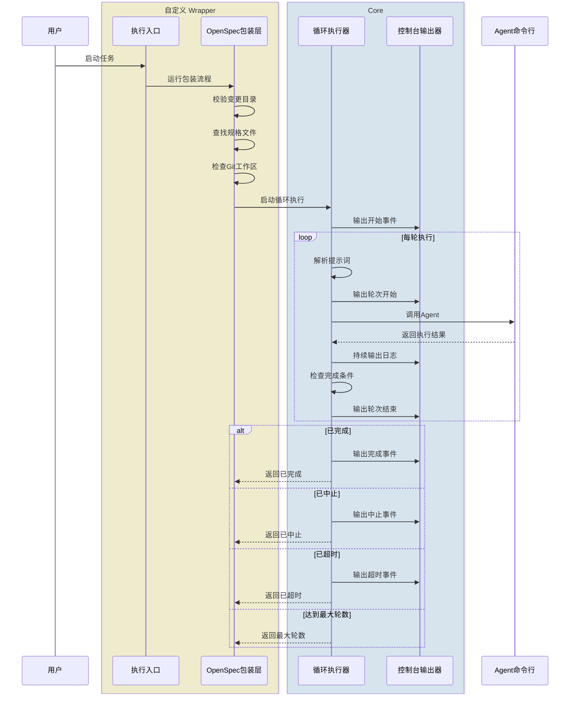

# Ralph Loop Dev

`ralph-loop-dev` 是一个基于 Bun 的最小 loop runtime 仓库，用来驱动文档型工作流。
当前重点场景是 OpenSpec：通过内置 wrapper prompt 模板和 runtime prompt 追加，把
`opencode`、`claude-code`、`codex`、`copilot` 这类 agent 放进统一的循环执行框架里。

它的设计目标不是复刻完整的 `open-ralph-wiggum`，而是保留真正需要的公共能力：

- 通用 loop 逻辑
- completion / abort 信号检测
- 多 agent 兼容
- 运行时 CLI UX
- 可复用的 wrapper 层

## 安装方式

### 前置要求

- 已安装 `bun`
- 已安装并可调用至少一个受支持的 agent CLI：`opencode`、`claude-code`、`codex`、`copilot`
- 如果使用 OpenSpec wrapper，需要仓库中存在 `openspec/changes/<change-id>/` 结构

### 手动安装

#### 方式一：clone 后安装

```bash
git clone <your-repo-url>
cd ralph-loop-dev
./install.sh
```

安装脚本会：

- 执行 `bun install`
- 生成全局命令 launcher
- 注册以下命令到全局 bin 目录：
  - `ralph-loop`
  - `ralph-run-openspec`

默认全局 bin 目录为 `~/.bun/bin`。

如果该目录不在 `PATH` 中，安装脚本会提示你追加：

```bash
export PATH="$HOME/.bun/bin:$PATH"
```

如果你想指定安装目录，可以这样做：

```bash
RALPH_BIN_DIR="$HOME/.local/bin" ./install.sh
```

安装脚本依赖仓库内的 `bin/install.ts`，因此需要在已经 clone 下来的仓库中执行。

### AI 场景安装

如果你是通过 AI coding agent 使用这个仓库，推荐让 agent 在仓库根目录直接执行：

```bash
./install.sh
```

安装完成后，agent 或你自己都可以直接调用：

```bash
ralph-loop ...
ralph-run-openspec ...
```

不再需要显式写：

```bash
bun run bin/ralph-loop.ts ...
bun run bin/ralph-run-openspec.ts ...
```

## 项目结构

```text
.
├── bin/
│   ├── install.ts
│   ├── ralph-loop.ts
│   └── ralph-run-openspec.ts
├── src/
│   ├── agents/
│   ├── core/
│   ├── install/
│   └── ui/
├── openspec-wrapper/
│   └── index.ts
├── openspec/
├── test/
├── install.sh
└── package.json
```

### 主要目录说明

- `bin/`
  - 命令入口层
  - `ralph-loop.ts` 是通用 loop CLI
  - `ralph-run-openspec.ts` 是 OpenSpec wrapper CLI
  - `install.ts` 是全局命令安装入口
- `src/core/`
  - 通用 loop runtime
  - 包括 completion 检测、prompt 组合、state store、process runner、loop runner
- `src/agents/`
  - 各种 agent 的适配层
  - 负责命令参数构造、输出归一化、question 检测、二进制覆盖逻辑
- `src/ui/`
  - 运行时 CLI 输出
  - 当前主要是 console reporter
- `openspec-wrapper/`
  - OpenSpec 的用户侧 wrapper 代码和内置 prompt 模板
  - 不放进 `src/core/`，避免工作流逻辑污染通用 runtime
- `src/install/`
  - 安装逻辑和全局命令路径处理
- `openspec/`
  - OpenSpec 配置与 change 文档
- `test/`
  - 单测、集成测试和 fake agent fixture

## 项目介绍

这个项目的核心定位是一个“最小可复用的 Ralph loop runtime”。

它解决的问题是：当你已经有一个相对固定的文档型工作流，比如 OpenSpec，希望用
AI agent 按外部 prompt 反复执行直到完成时，不想再依赖一个过重的大工具，也不想
把所有工作流逻辑硬编码进 core。

所以当前实现分成了两层：

- `ralph-loop`
  - 只负责通用 loop 运行时
  - 处理 iteration、success/abort、timeout、question、CLI reporter、多 agent 兼容
- `ralph-run-openspec`
  - 只负责 OpenSpec 专属逻辑
  - 校验 change 目录、查找 spec、补 runtime prompt、调用通用 loop

这种结构的好处是：

- core 足够小，方便维护和复用
- wrapper 可以按工作流继续扩展，而不污染 core
- 后续如果你要支持别的文档型流程，只需要新增新的 wrapper，而不是重写 loop runtime

## 流程时序图

下面这张图描述的是当前仓库最核心的执行链路：通过 wrapper 层（这里是`ralph-run-openspec`）拼接 prompt，并把执行交给通用 `ralph-loop`，再由 `ralph-loop` 驱动具体 agent CLI 循环运行。



如果只看一个最小心智模型，可以理解为：

- `ralph-run-openspec` 是一层基于 OpenSpec 工作流的 wrapper，负责处理与 OpenSpec 相关的输入校验、prompt 生成和结果解析
- `ralph-loop` 是 core，负责循环执行、状态持久化和完成条件判断
- 具体 agent CLI 只负责根据 prompt 产出结果，是否结束由 loop runtime 判定

## 循环执行说明

`ralph-loop` 的核心职责是“重复调用 agent，直到命中结束条件”，而不是替你自动拆任务。

当前实现里，一轮执行结束后是否继续，取决于 runtime 对输出结果的判断：

- 如果最后一个非空行命中了成功 promise，比如 `<promise>COMPLETE</promise>`，则结束
- 如果最后一个非空行命中了 abort promise，比如 `<promise>ABORT</promise>`，则结束
- 如果进程超时、被取消，或者达到 `--max-iterations`，则结束
- 只要以上条件都没有命中，就会进入下一轮

这意味着：如果 prompt 只是笼统地要求“把事情做完”，很多 agent 会倾向于在第一轮内尽量做完，或者直接给出总结并输出完成信号。那样虽然 technically 也在 loop 里运行，但效果会接近“只跑一轮”，和直接调用 agent 的差别不大。

更适合 `ralph-loop` 的做法，是给 agent 一个外部 task 清单，并明确要求它每轮只选择一个最小任务执行。这样 runtime 负责“重复跑”，而 prompt 和 task 文件负责“约束每轮只推进一小步”。OpenSpec 的 `tasks.md` 本质上也是这个模式的一个具体化实现。

## 参考示例 Prompt

下面这段不是推荐模板，只是一份参考示例，用来说明什么样的 prompt 更容易把 `ralph-loop` 用成真正的多轮执行，而不是退化成单轮调用。

```text
你正在执行一个需要多轮推进的任务。

请遵守以下规则：

1. 先读取 ./tasks.md，并把它当作唯一的任务清单来源。
2. 每一轮只选择一个“最小可执行任务”处理，不要在同一轮里做多个独立任务。
3. 如果当前任务需要修改代码，就只完成这个最小任务所需的最小改动。
4. 每轮结束前，重新检查 tasks.md 中是否还有未完成任务。
5. 只有当所有任务都完成时，才在最后一个非空行输出 <promise>COMPLETE</promise>。
6. 如果遇到阻塞并且无法继续推进，才在最后一个非空行输出 <promise>ABORT</promise>。
7. 如果任务还没完成，就不要输出任何 promise 标签，让 runtime 进入下一轮。

信号输出规则：

- 只有在你真正准备结束本次运行时，才可以输出可识别信号
- 如果还要继续下一轮、还有未完成任务、只是阶段性汇报，或当前回复并不是为了显式结束本次运行，都不要输出任何可识别信号
- 未结束时只用自然语言口头说明当前状态，不要输出 \`<promise>... </promise>\`、不要单独输出 \`COMPLETE\`、也不要输出其他可被外层识别为完成或中止的固定格式
- 只有当所有任务完成且验证通过，并且你此刻就是要结束本次运行时，才在最后一个非空行输出 `<promise>COMPLETE</promise>`
```

上面这个思路也可以替换成别的外部约束来源，例如：

- `tasks.md`
- checklist 文档
- issue 列表
- OpenSpec change 下的 `tasks.md`

关键不在于文件名，而在于：要让 agent 明确知道“还有剩余任务”，并且每轮只推进一个最小单位。

## 常用命令

### Core：最小可用的循环执行

直接给一段 prompt，让 `ralph-loop` 驱动 agent 循环运行。这个写法可以工作，但如果没有外部 task 约束，通常容易退化成只跑一轮。

```bash
ralph-loop --agent opencode "读取 ./tasks.md；每轮只完成一个最小任务；全部完成后在最后一行输出 <promise>COMPLETE</promise>"
```

### Core：通过 prompt 文件驱动循环

把长 prompt 放到文件里，便于维护“每轮只做一个最小任务”的约束。

```bash
ralph-loop --agent opencode --prompt-file ./prompts/loop-task.md
```

### Core：inline prompt 和 prompt 文件结合

把稳定规则放进文件，把本次任务目标放在命令行里追加传入。

```bash
ralph-loop --agent opencode --prompt-file ./prompts/loop-task.md "本次目标：完成 ./tasks.md 中优先级最高的未完成项"
```

### Core：自定义完成信号

默认成功信号是 `<promise>COMPLETE</promise>`。如果你已有现成 prompt 约定，也可以换成别的值，但标签格式本身仍然要保留。

```bash
ralph-loop --agent opencode --completion-promise DONE "读取 ./tasks.md；全部完成后输出 <promise>DONE</promise>"
```

### Core：自定义中止信号

当你希望 agent 在“确认阻塞且无法继续”时显式退出，可以加上 abort promise。

```bash
ralph-loop --agent opencode --abort-promise ABORT "读取 ./tasks.md；若无法继续则输出 <promise>ABORT</promise>"
```

### Core：限制最大轮数

`--max-iterations` 适合给 loop 一个上限，避免任务没有结束信号时无限运行。

```bash
ralph-loop --agent opencode --max-iterations 20 --prompt-file ./prompts/loop-task.md
```

### Core：设置无活动超时

`--last-activity-timeout` 用于限制单轮进程在长时间没有输出时自动退出。单位是毫秒。

```bash
ralph-loop --agent opencode --last-activity-timeout 600000 --prompt-file ./prompts/loop-task.md
```

### Core：恢复上一次运行

如果某轮因为超时中断，可以基于保存的 active-run 状态继续跑。

```bash
ralph-loop --resume
```

### Core：切换 agent、model，并透传原生命令参数

`ralph-loop` 自己处理通用 loop 逻辑，`--` 后面的参数会原样透传给底层 agent CLI。如果你需要覆盖默认的 agent 命令路径，也可以配合环境变量一起使用。

```bash
ralph-loop --agent codex --model gpt-5 --prompt-file ./prompts/loop-task.md -- --approval-mode full-auto
```

```bash
RALPH_OPENCODE_BINARY="$(which opencode)" ralph-loop --prompt-file ./prompts/loop-task.md
```

### Core：自定义 CLI 输出颜色

`ralph-loop` 会把 CLI 输出分成 3 类：

- `core`
  - banner
  - iteration 标题
  - heartbeat
  - 完成、取消、超时等摘要
- `agentStdout`
  - agent 标准输出
- `agentStderr`
  - agent 错误输出

默认配色是低干扰风格：

- `core = cyan`
- `agentStdout = default`
- `agentStderr = yellow`

你可以通过 `config.jsonc` 自定义颜色，读取优先级为：

- 内置默认值
- 全局配置：`~/.ralph-loop/config.jsonc`
- 项目配置：`<repo>/.ralph-loop/config.jsonc`

项目配置会覆盖全局配置中的同名字段。配置文件结构如下：

```jsonc
{
  "colors": {
    "core": "cyan",
    "agentStdout": "default",
    "agentStderr": "yellow",
  },
}
```

当前支持的颜色值只有以下命名颜色：

- `default`
- `gray`
- `blue`
- `cyan`
- `green`
- `yellow`
- `red`
- `magenta`

非法颜色值会自动回退到上一级配置或内置默认值。颜色默认只会在 TTY 环境下输出；如果你想在测试或管道里强制开启 ANSI 颜色，可以设置：

```bash
FORCE_COLOR=1 ralph-loop --prompt-file ./prompts/loop-task.md
```

### Wrapper：运行 OpenSpec 工作流

如果你的任务本身就是 OpenSpec change，可以直接使用现成 wrapper。它会做 OpenSpec 目录校验、查找 spec，并补充对应的 runtime prompt。

```bash
ralph-run-openspec --change-id add-ralph-loop-core --max-iterations 30 --agent opencode
```

支持的环境变量包括：

- `RALPH_OPENCODE_BINARY`
- `RALPH_CLAUDE_BINARY`
- `RALPH_CODEX_BINARY`
- `RALPH_COPILOT_BINARY`
- `RALPH_SKIP_GIT_CLEAN_CHECK=1`
